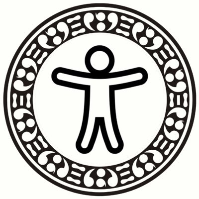
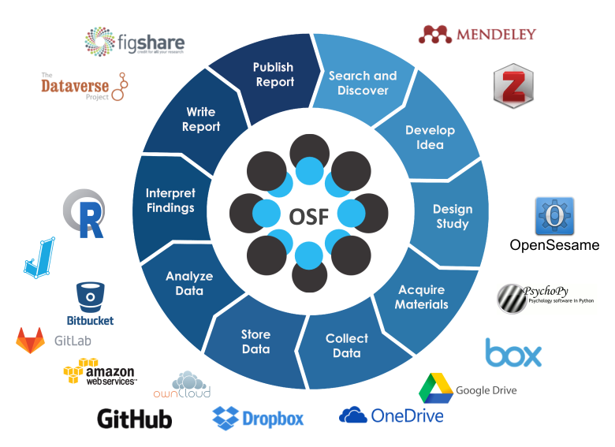

class: inverse, middle, title-slide

```{r setup, include=FALSE}
library(fontawesome)
library(tidyverse)
options(htmltools.dir.version = FALSE, width=120)
```

class: title-slide, spaced



## Memperkenalkan...

# #SainsTerbuka Airlangga `r fa("universal-access")`

---

class: middle, inverse, center

# Apa itu #SainsTerbuka?


---

# [Foster #OpenScience](https://www.fosteropenscience.eu/foster-taxonomy/open-science-definition)


---

# Research Cycle



---

# Benefit #SainsTerbuka

* Meningkatkan kualitas riset dan reportingnya
* Memungkinkan *networking* dan kolaborasi yang lebih luas
* Mereformasi cara ilmuwan mengelola relasi (lebih terbuka dan egaliter)
* Memperluas dampak riset
* Menambah motivasi intrinsik

---

class: middle, center

# #SainsTerbuka Airlangga

`r fa("paper-plane")` <a href="mailto:sainsterbuka.ua@gmail.com"></i>&nbsp; sainsterbuka.ua@gmail.com</a>
`r fa("twitter")` [@sainsterbukaUA](https://twitter.com/sainsterbukaUA)
`r fa("github")` [@sainsterbukaua](https://github.com/sainsterbukaua)
`r fa("desktop")` https://sainsterbukaUA.github.io
`r fa("facebook-f")` [Komunitas Sains Terbuka Airlangga](https://www.facebook.com/SainsTerbukaAirlangga/)

---

# Manifesto

* Mendorong peneliti untuk menyadari potensi terjadinya bias kognitif yang berakar dari keterbatasannya pribadi ketika melaksanakan penelitian
* Menggarisbawahi pentingnya pelatihan metodologi, utamanya bagi peneliti pemula dan mahasiswa
* Mempromosikan kolaborasi dan pendekatan tim saintis
* Mempromosikan praktik baik dalam meneliti (*good research practices*)
* Mendorong peneliti untuk melakukan [pra-registrasi](https://cos.io/prereg/) dan menggunakan format [laporan teregistrasi](https://cos.io/rr/)
* Menekankan pentingnya peningkatan kualitas pelaporan penelitian (lengkap dan *reproducible*)
* Mendorong penggunaan piranti lunak dengan prinsip sumber terbuka (*open source*) dan *reproducible* (misalnya <a href="https://www.r-project.org" target="_blank"><i class="fab fa-r-project"></i></a>, <a href="https://www.python.org/" target="_blank"><i class="fab fa-python"></i></a> dan yang lainnya)
* Mendorong evaluasi kinerja peneliti dengan menggunakan prinsip transparansi dan keterbukaan (contohnya [Transparency and Openness Promotion (TOP) Guideline](https://cos.io/top/) dari [Center for Open Science](https://cos.io/about/mission/)) tidak sekedar menggunakan metrik proksi, seperti H-Index, JIF, dsb.
* Mendorong pembatasan penggunaan metrik proksi dan mendorong pengambil keputusan menggunakan metrik-metrik tersebut secara bertanggung jawab, sesuai dengan [San Fransisco Declaration of Research Assessments (SF-DORA)](https://sfdora.org/read/)

---

# Aktivitas

* Blogging, kampanye medsos
* Promosi di internal Unair -> nanti dibuatkan slide standar yang bisa digunakan utk memperkenalkan #SainsTerbuka
* Webinar -> agenda terdekat, kerjasama dg UGM, ITB, dan Center for Open Science 
* Workshop & drop-in session
* Advokasi internal -> audiensi (?)

# Kontribusi anggota tim

[USULAN]

* Amel: website maintainer, medsos, jaringan, program
* Ilham: medsos, promosi, blog, jaringan nasional
* Agie: program, jaringan nasional, advokasi internal Unair
* Jovi: advokasi internal Unair, promosi, jaringan
* Ulul: program, promosi, jaringan (pengelola jurnal)
* Shochrul: program, promosi, blog, advokasi internal Unair

---

class: center, middle, inverse

# Thanks!

Slides created via the R package [**xaringan**](https://github.com/yihui/xaringan).

The chakra comes from [remark.js](https://remarkjs.com), [**knitr**](http://yihui.name/knitr), and [R Markdown](https://rmarkdown.rstudio.com).
